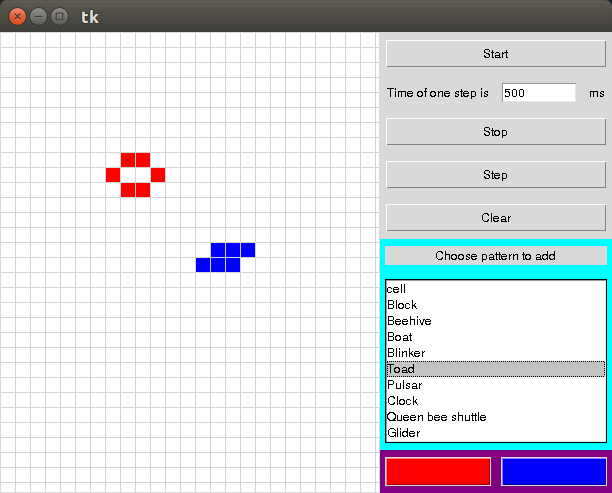

# Игра "Жизнь"

Репозиторий является семестровым проектом по курсу ["Совместная разработка 
приложений на Python3"](http://uneex.org/LecturesCMC/PythonDevelopment2019).

Задача проекта состоит в реализации на языке Python 3 клеточного автомата
Джона Конвея - 
[игры "Жизнь"](https://ru.wikipedia.org/wiki/%D0%98%D0%B3%D1%80%D0%B0_%C2%AB%D0%96%D0%B8%D0%B7%D0%BD%D1%8C%C2%BB).

Программа способна визуализировать сетку игры с возможностью
* сделать "живыми" (закрасить) произвольные клетки сетки
* запустить игру на полученной конфигурации
* совершить один шаг игры
* запустить игру на постоянное последовательное совершение шагов и ставить ее
 на паузу
* произвольным образом менять конфигурацию игры в любой момент
* очистить сетку от всех "живых" клеток
* произвольно перемещаться по сетке игры при помощи ПКМ
* добавить одну из заранее определенных конифигураций на сетку игры. Например, 
  [Glider](https://ru.wikipedia.org/wiki/%D0%9F%D0%BB%D0%B0%D0%BD%D0%B5%D1%80_(%D0%BA%D0%BE%D0%BD%D1%84%D0%B8%D0%B3%D1%83%D1%80%D0%B0%D1%86%D0%B8%D1%8F_%D0%BA%D0%BB%D0%B5%D1%82%D0%BE%D1%87%D0%BD%D0%BE%D0%B3%D0%BE_%D0%B0%D0%B2%D1%82%D0%BE%D0%BC%D0%B0%D1%82%D0%B0))

При этом возможна не только классическая игра "Жизнь", но и ее вариант [Immigration](http://www.conwaylife.com/wiki/Immigration#Immigration): клетки могут быть двух цветов.

Внешний вид программы:

